#  frogsprite

A pixel-sprite editor whose entire feature set is reachable from JavaScript, so an LLM agent can
draw, animate and export sprites without ever touching the UI.

It is a normal editor if you want to click things. The difference is that every button is a thin
wrapper around a command on `window.frogsprite`, and that API is the documented surface rather than
an afterthought — an agent reads [AGENTS.md](AGENTS.md), opens the page, and starts drawing.

```js
frogsprite.new_package('critters');
frogsprite.new_set('frog', 16);          // grid: 8, 16, 32, 64 or 128
frogsprite.new_sprite('idle');
frogsprite.paint_map(['.gg.', 'gggg'], { g: '#22aa33' });
frogsprite.print_sprite();               // read your own work back as ASCII
await frogsprite.export_zip({ download: true });
```

## Quick start

```bash
npm install
npm run dev
```

Requires Node 23.6+ (the test runner uses native TypeScript type stripping).

A first visit seeds itself from `public/examples.json` — the `frog16` and `frog32` jumping frogs, so
the editor opens on real sprites instead of an empty grid. They are ordinary editable data, and the
file is fetched rather than bundled, so it costs nothing on later visits.

| script | |
| --- | --- |
| `npm run dev` | dev server |
| `npm run build` | static build into `dist/` |
| `npm run preview` | serve the build |
| `npm run check` | `svelte-check` + `tsc` |
| `npm test` | pure-logic self-checks (`node --test`) |

## Concepts

```
package  →  set (fixed grid size)  →  sprites
                                 →  animations  →  frames
```

A **set** is one character or object: every sprite in it shares the same grid, and they are that
character's different actions or poses. A set owns any number of named **animations**, each an
ordered list of `{ sprite, ms }` frames — all over the same sprites, so one pose can appear in
`walk`, `idle` and `hurt` at once.

A frame can also carry an **effect** (invert, reduce to one hue, rotate, flip, displace), a **motion
trail** (the frames before it, drawn underneath and dimmed), and a **transition** (scan in from the
top or bottom, dissolve away, flatten to a silhouette with the next frame arriving over it). All
three are applied when the frame is *drawn*, so the sprite underneath stays exactly as painted and
the other animations sharing it are untouched. See [AGENTS.md](AGENTS.md#animation).

Click a frame's thumbnail in the timeline and it expands into an effect tray, with a
`this frame | all frames` switch — effects are usually uniform across an animation, so one click can
set the lot. A frame with a transition also gets a slider that scrubs through it. **Effects** in the
sidebar holds one-click recipes (Comet, Ghost, Flash, Fade in, Hue cycle, Clear effects).

Colours come from a fixed 256-entry palette: index `0` is transparent, `1`–`216` are a 6×6×6 RGB
cube, and `217`–`255` are a 39-step grey ramp. Anywhere a colour is accepted you can pass an index,
a hex string (snapped to the nearest entry), or `null` for transparent.

## Two ways to drive it

**The UI** — sidebar for packages/sets/sprites, click or drag to paint, a colour row showing the
shades actually used in the current set, a frame timeline with thumbnails and transport controls
(play / pause / step / stop), and export buttons. **⌘Z / Ctrl+Z** undoes, **⇧⌘Z** redoes — a whole
drag is one step.

Under **Tools** in the sidebar: **Shapes** draws a line, square, circle, ellipse, triangle or
polygon from one dialog, filled in the current colour; **View** holds the review controls — square
swatches set what shows through transparent pixels
(`background('#ff00ff')` finds holes and stray pixels), round ones flatten the sprite to a
silhouette (`silhouette()` finds a lumpy edge or a pose that doesn't read). Both are view settings —
nothing is painted and nothing is saved, unless you ask for `silhouette(color, { permanent: true })`.

**JavaScript** — everything above, plus batch drawing. `paint_map()` takes ASCII art and is by far
the fastest way to draw a sprite; `shapes.circle()` and friends fill a whole form in one call (and
one undo step), with `{ fill: false }` for outlines; `reflect()` mirrors half the grid onto the
other half; `print_sprite()` renders a sprite back as ASCII so an agent can check its own work.

**[AGENTS.md](AGENTS.md) is the full command reference.** It is also served at `/AGENTS.md` (with a
short `/llms.txt` summary) so an agent that lands on a deployed instance can find it.

## Exporting

| | |
| --- | --- |
| `export_zip` | the whole set: every sprite as PNG and SVG, one SVG per animation, plus `set.json` with raw pixel data — the closest thing to a project file |
| `export_svg` | one sprite, horizontal runs merged into single rects |
| `export_animated_svg` | one animation as a self-contained looping SVG |
| `export_png` | one sprite at any scale |
| `export_ico` | multi-size icon |
| `export_json` | the set's raw pixel data on its own — no pictures, no archive |
| `export_project` | every package, in the shape the editor persists |

`import_set()` takes back an `export_json` payload **or a whole export ZIP** (it reads `set.json`
out of it), and `import_project()` takes back a project. Both accept an object, JSON text or a
dropped file, and both run the same validator that guards `localStorage`. That is the answer to
work being stuck in one browser: save the JSON, open it somewhere else.

## Importing an image

`import_image()` pixelates a picture into the grid: each cell becomes the alpha-weighted average of
the source pixels under it, snapped to the palette. It can auto-trim a transparent or uniform
border, fit with `contain` / `cover` / `stretch`, and apply a small contrast and saturation boost
(small grids plus a coarse palette look flat without one). In the UI: the Import button, or drop or
paste an image onto the canvas.

Expect a starting point rather than a finished sprite — it works best on high-contrast, simple,
centred subjects, and smooth gradients will band visibly.

## Deploying

**Static files only.** No backend, no API keys, no database, no server-side rendering. The build is
seven files totalling ~160 KB (30 KB gzipped JS), there is no router so no SPA-fallback rewrites are
needed, and after the first visit fetches `examples.json` the app makes no network requests at all.

Verified end to end against `python3 -m http.server`: drawing, animation, image import and all five
export formats work with nothing but a static file server.

Work is saved to `localStorage`, which means it is per-origin and per-browser — no sync and no
sharing between devices. That is the one feature that would genuinely require a backend.

## Project layout

| path | |
| --- | --- |
| `src/lib/api/commands.ts` | the `window.frogsprite` API — the only surface agents touch |
| `src/lib/state/store.svelte.ts` | reactive state (`$state` class), selection, playback |
| `src/lib/core/` | the framework-free engine (no Svelte, no DOM): `palette`, `grid`, `shapes`, `fx`, `selection`, `history`, `types` |
| `src/lib/io/` | pixels in and out: `storage` (localStorage), `export`, `image`, `zip` |
| `src/lib/ui/*.svelte` | UI: sidebar, canvas, palette, animation timeline |
| `src/lib/**/*.test.ts` | `npm test` — self-checks for the DOM-free logic, one file per module, co-located |
| `public/examples.json` | the `frog16` / `frog32` sets seeded on a first visit |
| `public/icon.svg` | the project icon — favicon, sidebar, README |

## Implementation notes

**Zero runtime dependencies.** Svelte and Vite are build-time only; `package.json` has an empty
`dependencies`. Things that would normally pull in a library use platform APIs instead:

- **ZIP** — `CompressionStream('deflate-raw')` emits exactly the raw deflate stream that ZIP method
  8 expects, so the writer is ~100 lines (CRC-32, headers, central directory) with no JSZip.
  Entries that don't shrink fall back to stored. Validated against the real `unzip` binary. Reading
  is the same trick in reverse — walk the central directory, `DecompressionStream` the one entry
  asked for, check its CRC.
- **ICO** — a container around canvas-produced PNGs, which Windows has accepted since Vista.
- **Image downscaling** — the browser handles the coarse reduction, then an explicit box average
  does the final step. Browser downscaling is not a defined box average and aliases badly at the
  ratios involved here (1024 px into a 16 px grid is 64×).
- **Persistence** — writes are coalesced, so a burst of painting becomes one `localStorage` write,
  and a pending write is flushed on `pagehide`. Loading validates what it reads, so damaged or
  outdated data degrades gracefully instead of breaking the editor.
- **Undo** — whole-document snapshots (the same JSON that gets saved) rather than per-command
  inverses. The document is small, and every command plus the canvas itself mutates it in place, so
  reversible-command bookkeeping would only be a way to miss one. Restoring is a `parse()` away, and
  a drag coalesces into one step the same way writes coalesce into one save.
- **The canvas is a `<canvas>`, and pixels are a `Uint8Array`** — the two halves of one decision.
  Svelte's deep proxy leaves anything that isn't a plain object or array alone, so a typed array
  keeps 16384 cells out of the reactive graph: an undo snapshot of a 128 grid serialised in ~29ms
  through the proxy and ~1ms as plain data, twice per command. What that costs is per-pixel
  reactivity, so the editor draws through the same renderer the PNG exporter uses and redraws on
  one signal — `editor.revision`, bumped by every `save()`. Reading pixel *contents* anywhere
  reactive goes through `pixelsOf(sprite)`, which subscribes to that signal on the way past;
  reaching for `sprite.pixels` directly in a component renders once and then never updates again.

## Known limitations

- **Undo is session-only** — 50 steps, and a reload starts from an empty stack with your saved work.
- **No delete** for packages, sets or sprites.
- **Large grids cost snapshot time, not render time** — the canvas redraws in about a millisecond
  at any size, but every command still serialises the whole document twice for undo, which is
  ~3.5ms once a project holds a few 128 sprites. Snapshotting only the set that changed is the next
  move if that ever bites.
- **No spritesheet export** — the ZIP contains individual PNGs, not a packed strip.
